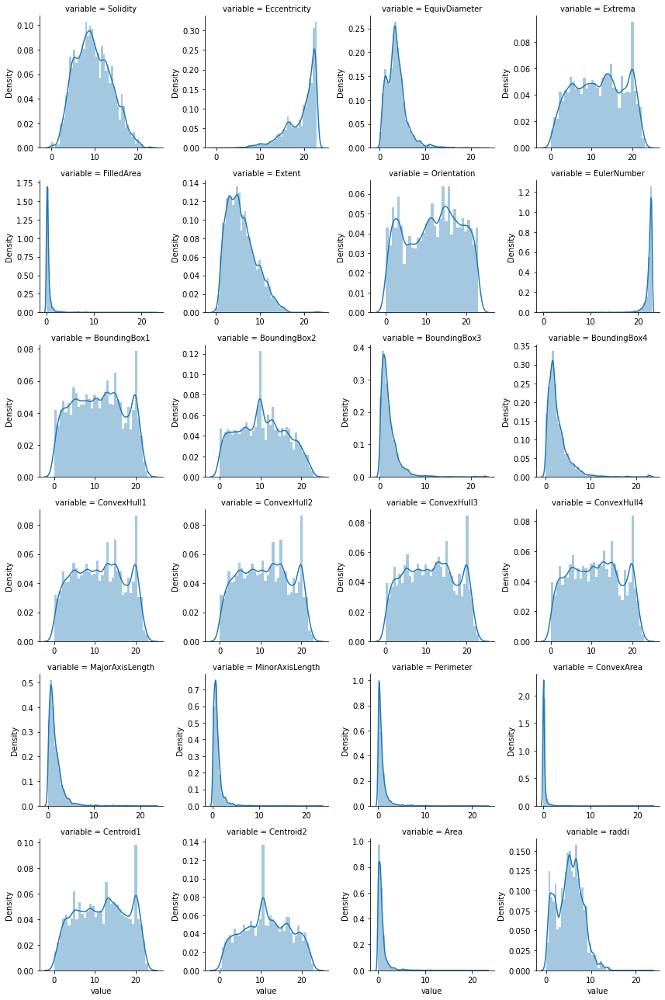
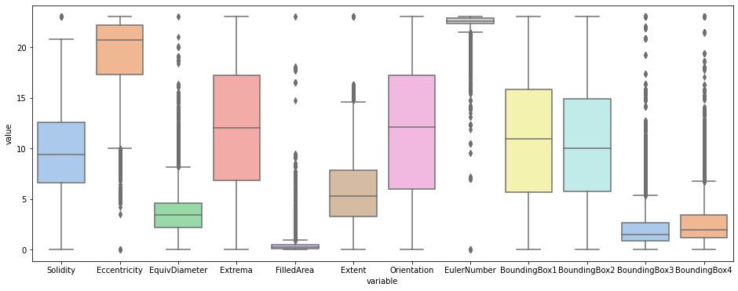
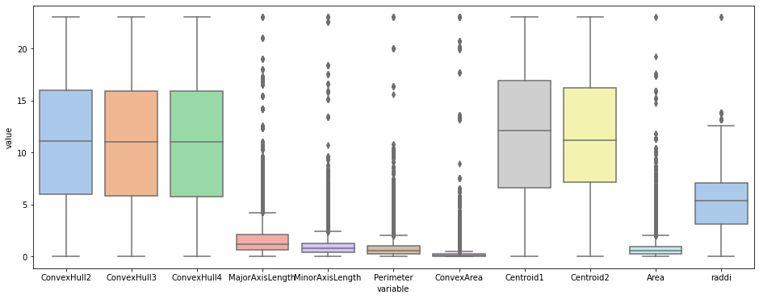
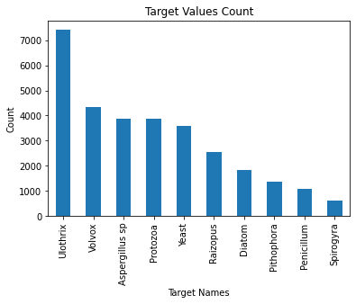
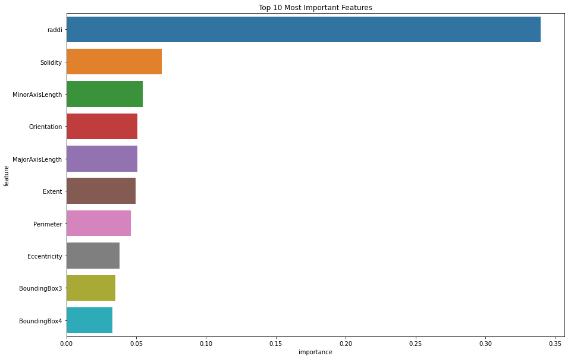
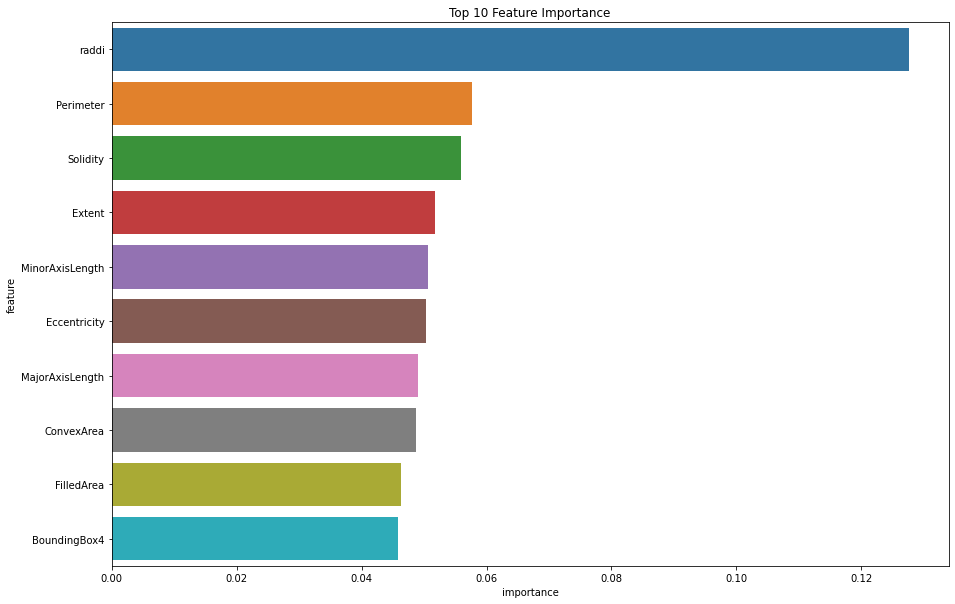
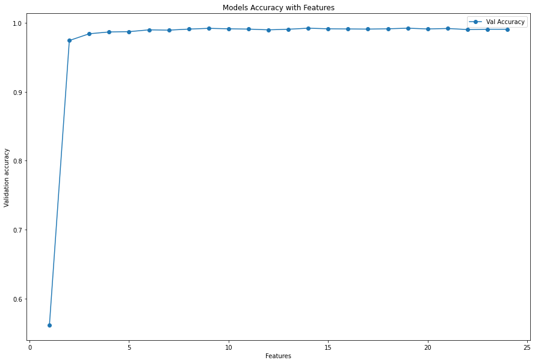
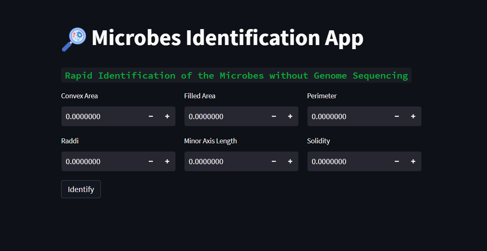

# Microbes-Identification-with-Machine-Learning
 Identification of microbes with machine learning
 
 
## Libraries Used
* Pandas
* Matplotlib
* Seaborn
* scikit-learn
* XGBOOST
* treeplot
 
## Contents
* Problem Defination
* Why I am doing this project?
* Proposed Solution
* Objective
* Data Summary
* Approach
* Packages Import
* Exploratory Data Analysis
* Data Visualization
* Data Preprocessing
* ML Modelling
  * Logistic Regression
  * Naive Bayes Classifier
  * Decision Tree Classifier
  * Random Forest Classifier
  * XGBOOST Classifier
  * Features Selection with XGBOOST
  * Training XGBOOST with Best 6 Features
* Saving Model Weights
* XGBOOST Model Deployment with Streamlitm

## 📖 Problem Defination
Bacteria are responsible for causing a wide variety of infectious diseases, including pneumonia, septicemia, meningitis, urinary tract infections, and endocarditis. To identify the specific pathogen causing the infection, doctors often rely on traditional methods such as culturing the organism in a laboratory dish. However, this approach may take weeks or even months before results are known.

Novel DNA sequencing technologies have proliferated over the past two decades. Continuous improvements in "next generation sequencing" (NGS) and "third generation sequencing" (TGS) have increased the fidelity and rate of sequencing, but it still takes hours or days to obtain a complete sequence. Furthermore, there are some clinical applications in which very rapid identification of a particular gene or genetic species becomes necessary, whereas identification of all genes is not necessary.

## Why I am doing this project?
In patients with septic shock from bacterial infection, identification of antibiotic-resistance genes is essential because mortality increases with a delay of 7.6% per hour in administering the correct antibiotics. Unfortunately, it takes more than 24 hours for bacteria recovered from an infected patient's blood to grow, Identifying the kind of microbe responsible for a infection is critical because certain kinds of bacteria are sensitive to particular antibiotics. Once the species of bacteria is identified, doctors can prescribe the right medication to treat the infection.

## Proposed Solution
Bacterial antibiotic resistance is becoming a significant health threat, and rapid identification of antibiotic-resistant bacteria is essential to save lives and reduce the spread of antibiotic resistance.

So we will train a supervised machine learning classification model to identify microbes from Generalized Segmentation Algorithm (GSA) Data

## 🔎 Objective
Identify the ten different micro-forms of life from Generalized Segmentation Algorithm (GSA) Data

## 💾 Data Summary

* Solidity: It is the ratio of area of an object to the area of a convex hull of the object. Computed as Area/ConvexArea.
* Eccentricity: The eccentricity is the ratio of length of major to minor axis of an object.
* EquivDiameter: Diameter of a circle with the same area as the region.
* Extrema: Extrema points in the region. The format of the vector is [top-left top-right right-top right-bottom bottom-right bottom-left left-bottom left-top].
* Filled Area: Number of on pixels in FilledImage, returned as a scalar.
* Extent: Ratio of the pixel area of a region with respect to the bounding box area of an object.
* Orientation: The overall direction of the shape. The value ranges from -90 degrees to 90 degrees.
* Euler number: Number of objects in the region minus the number of holes in those objects.
* Bounding box: Position and size of the smallest box (rectangle) which bounds the object.
* Convex hull: Smallest convex shape/polygon that contains the object.
* Major axis: The major axis is the endpoints of the longest line that can be drawn through the object. Length (in pixels) of the major axis is the largest dimension of the object.
* Minor axis: The axis perpendicular to the major axis is called the minor axis. Length (in pixels) of the minor axis is the smallest line connecting a pair of points on the contour.
* Perimeter: Number of pixels around the border of the region.
* Centroid: Centre of mass of the region. It is a measure of object’s location in the image.
* Area: Total number of pixels in a region/shape.
* microorganisms : [Spirogyra, Volvox, Pithophora, Yeast, Raizopus, Penicillum, Aspergillus sp, Protozoa, Diatom, Ulothrix]

## 🛬 Approach
* Supervised Learning
* Classification
* Multi-class Classification

## Packages Import
 Imported all the required packages
## Exploratory Data Analysis
 * No Null Values are Found in dataset
 * Almost all columns are of float datatype
 * Rows in dataset :  30527
 * Columns in dataset :  25
 * Descrptive Stats : Min , Max, Mean and Std are obtained with pandas describe method
 
### Distribution plots
   
   `Some of the plots are of bell shaped`
   `Some plots are Skewed which shows the presense of outliers also suggest us the need to normalize data`
   
### Boxplot  
A box plot is a highly visually effective way of viewing a clear summary of one or more sets of data.
A box plot is one of very few statistical graph methods that show outliers.
 

`From the above plot we see that the data is basically distributed between 0-30`
`Many columns are containing Outliers`
 
### Target Value Count

Dataset is unbalance

### Correlatiot Heatmap Plot
 

`By Looking at the above correlation plot we see many features are highly correlated with each other, black color shows the high +ve correlation`
`Some features are negatively correlated with each other , light color in plot shows the negative correlation`

## Data Preprocessing

 * Seprating input and output columns
 * Splitting Dataframe into Input and Target dataframe
 * Train, Validation and Test Split
 * Data Normalization

## ML Modelling

### Logistic Regression
  One of the most often used Machine Learning algorithms, within the category of Supervised Learning, is logistic regression. It is used for predicting the categorical dependent variable using a given set of independent variables. Logistic regression uses a method known as maximum likelihood estimation to find an equation of the following form
#### Model Evaluation
  Evaluation scores of model shows that model is underfittng Data, So we  need to move to some other more comoplecx algorithm.
    
### Naive Bayes
 A group of supervised learning algorithms known as naive Bayes methods utilise Bayes' theorem with the "naive" assumption that each pair of features is conditionally independent given the value of the class variable.
 
#### Model Evaluation
 Evaluation scores of model shows that model is underfittng Data, So we  need to move to some other more comoplecx algorithms
 
### Decision Tree Classifier
Decision Tree is a supervised learning method that can be applied to classification and regression problems, however it is most frequently used to solve classification problem. It is a tree-structured classifier, where internal nodes represent the features of a dataset, branches represent the decision rules and each leaf node represents the outcome.

The CART algorithm, which stands for Classification and Regression Tree algorithm, is used to construct a tree.
A decision tree simply asks a question and divides the tree into subtrees according to the answer (Yes/No).
    
* Hyper Parameter Tunning for Decision Tree Classifier
Hyperparameter optimization or tuning is the problem of choosing a set of optimal hyperparameters for a learning algorithm. A hyperparameter is a parameter whose value is used to control the learning process. By contrast, the values of other parameters  are learned.
    
By Setting max_depth=26 we are able to reduce overfiitting of decision tree by very little value.

### Model Evaluation
Decision tree accuracy score on validation set  :  0.9868995633187773
### Decision Tree visualization
We have plotted the decision tree with sklearn plot_tree method

### Feature Importance

    
## Random Forest Classifier
Random Forest is a powerful and versatile supervised machine learning algorithm that extends and combines multiple decision trees to form a "forest". It can be used for both classification and regression problems.

The Random Forest model is based on the idea that several uncorrelated models (the various decision trees) work significantly better together than they do separately. Each tree provides a classification or a "vote" when using Random Forest for categorization. The classification with the most "votes" is chosen by the forest.

### Model Evaluation
Random forest accuracy score on validation set  : 0.9873362445414847

### Feature Importance

    
    
## XGBOOST Classifier
The Extreme Gradient Boosting algorithm, also known as XGBoost, is a decision tree-based machine learning technique that uses boosting to enhance performance. Boosting is a sequential strategy that operates under the ensemble theory. It improves prediction accuracy by combining a group of weak learners.

### Label Encoding target column
Label Encoding refers to converting the labels into a numeric form so as to convert them into the machine-readable form. Since XGBOOST algorthm work completely on numerical data.
### Model Evaluation
Accuracy Score on test data :  0.9903930131004367
    
### Models Accuracies on Test Data
   * DTC1 Accuracy :  0.9865125240847784
   * RFC Accuracy :   0.9884393063583815
   * XGB Accuracy :  0.9922928709055877

### Features Selection with XGBOOST

    
## Training XGB with Top 6 Features only
* Top 6 Features :  'ConvexArea', 'raddi', 'FilledArea', 'MinorAxisLength', 'Perimeter', 'Solidity'
* XGBOOST Accuracy on Validation data 0.9899563318777292
* Accuracy on Test data : 0.991907514450867
## Saving Model 
Model  and label encoder are saved using joblib library to retrieve the the trained model for deployement perpose.

### Web Deployed App Link

<a href="https://omjiverma-microbes-identi-microbes-identification-webapp-qh6iaz.streamlitapp.com/">Open Webbapp</a>
